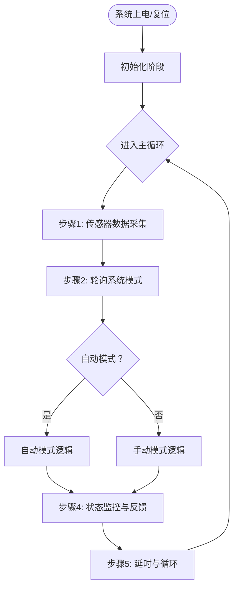

好的，这是修正后的**全中文标签**的Mermaid流程图，确保在标准Mermaid解析器中可以正常渲染：

---

### 关键修正说明：
1.  **节点标签**：将所有描述性文字（包括判断条件）都放入**英文双引号 `" "`** 内。
2.  **开始/结束节点**：使用 `(["标签"])` 来表示椭圆（起止点）。
3.  **判断节点**：使用 `{"标签"}` 来表示菱形（判断分支）。

这个版本应该能够解决您遇到的解析错误，可以在支持Mermaid的环境（如Typora、VS Code with插件、Mermaid Live Editor等）中正确显示。
